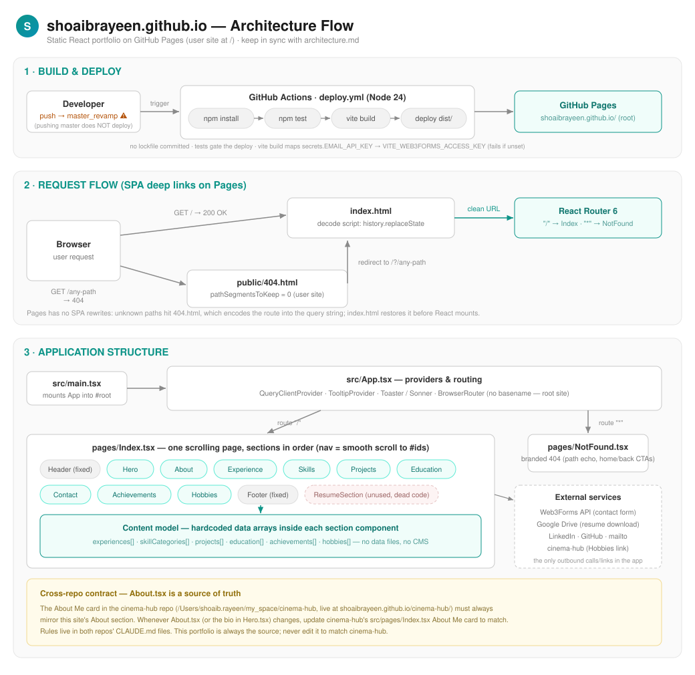

# shoaibrayeen.github.io — Architecture

> **Rule:** this document and [architecture.svg](architecture.svg) must be updated in the same commit as any change that affects structure, routing, sections, content model, build, or deployment. See [CLAUDE.md](CLAUDE.md).



## Overview

A fully static single-page portfolio: one scrolling page composed of self-contained section components, rendered client-side with all content hardcoded in the components themselves. No backend and no CMS — the only network calls are the contact form (Web3Forms) and the resume download (Google Drive). It deploys as a **GitHub Pages user site** served at the domain root `https://shoaibrayeen.github.io/`.

**Stack:** Vite 5 · React 18 · TypeScript (loose mode) · React Router 6 · Tailwind CSS + shadcn/ui (Radix) · next-themes (light/dark) · lucide-react icons · sonner toasts. **Tests:** Vitest 3 + Testing Library (jsdom).

## Directory layout

```
├── README.md                   # repo overview, quick start, deploy notes
├── index.html                  # SEO meta (title/OG/Twitter/canonical) + favicon links + pre-paint theme init script + SPA-redirect decode script
├── vite.config.ts              # default base "/" (user site), @ → src alias, dev port 8080
├── .env.example                # template for .env.local (VITE_WEB3FORMS_ACCESS_KEY — contact-form key)
├── .github/workflows/deploy.yml  # CI/CD — triggers on master_revamp (NOT master); maps EMAIL_API_KEY secret → build env
├── MIGRATION.md                # historical: Jekyll → React migration notes
├── public/
│   ├── 404.html                # spa-github-pages redirect (pathSegmentsToKeep = 0) + branded "redirecting" splash
│   ├── .nojekyll               # disable Jekyll on Pages
│   ├── favicon.svg             # "SR" monogram tab icon (teal→cyan brand gradient)
│   ├── favicon-32x32.png       # PNG fallback favicon
│   ├── apple-touch-icon.png    # 180×180 iOS home-screen icon
│   ├── profile.png             # hero profile photo (~914 KB)
│   └── robots.txt              # allow-all crawler rules
└── src/
    ├── main.tsx                # mounts <App /> into #root
    ├── App.tsx                 # providers + router ("/" → Index, "*" → NotFound)
    ├── pages/
    │   ├── Index.tsx           # THE page — composes all sections in order
    │   └── NotFound.tsx        # branded 404 page (teal/cyan, requested-path echo, home/back CTAs, mailto)
    ├── components/             # one component per portfolio section (content lives inside each)
    │   ├── Header.tsx          # fixed top nav, scroll-blur effect, theme toggle, mobile hamburger
    │   ├── Hero.tsx            # #home — profile, headline, CTAs, resume download (Google Drive)
    │   ├── About.tsx           # #about — bio, stat cards, 3 expertise cards  ← source of truth for cinema-hub's About Me
    │   ├── Experience.tsx      # #experience — experiences[] timeline (Sirion ×4 roles, Airtel, PropTiger)
    │   ├── Skills.tsx          # #skills — skillCategories[] (11 categories) + competency badges
    │   ├── Projects.tsx        # #projects — projects[] (11 featured project cards)
    │   ├── Education.tsx       # #education — education[] (MCA, B.Sc.)
    │   ├── Contact.tsx         # #contact — social cards + form → Web3Forms API
    │   ├── Achievements.tsx    # #achievements — awards / certifications / leadership arrays
    │   ├── Hobbies.tsx         # #hobbies — hobbies[] (6 cards); Cinema card links out to cinema-hub
    │   ├── Footer.tsx          # fixed bottom copyright bar
    │   ├── ThemeToggle.tsx     # sun/moon light↔dark switch (next-themes useTheme), rendered in Header
    │   ├── ResumeSection.tsx   # UNUSED — commented out of Index; resume DL lives in Hero
    │   └── ui/                 # ~47 shadcn/ui primitives (generated; only a few used)
    ├── hooks/                  # use-mobile (768px media query), use-toast
    ├── lib/utils.ts            # cn() class merge helper
    └── test/                   # vitest setup + suites (see Testing)
```

## Page composition & content model

`Index.tsx` renders every section in a fixed order (Header → Hero → About → Experience → Skills → Projects → Education → Contact → Achievements → Hobbies → Footer) with a fade-in on mount. **Navigation is smooth-scroll to section `id`s** (`scrollIntoView`), not routing — the router only distinguishes `/` from the 404 fallback.

**All content is hardcoded inside each section component** as local data arrays (`experiences[]`, `skillCategories[]`, `projects[]`, `education[]`, `achievements[]`, `hobbies[]`) or inline JSX (Hero, About). There is no shared data file — to edit portfolio content, edit the owning component. No props flow between sections; each is self-contained.

### External integrations (the only network calls)

| Integration | Where | How |
|---|---|---|
| **Web3Forms** | `Contact.tsx` | `POST https://api.web3forms.com/submit` with access key from `import.meta.env.VITE_WEB3FORMS_ACCESS_KEY` (GitHub Actions secret in CI, `.env.local` locally), whitespace-stripped (`/\s/g`) so a newline pasted into the secret can't produce an invalid-UUID rejection; honeypot spam field; sonner toast feedback; `isSubmitting` state |
| **Google Drive** | `Hero.tsx` | Direct-download link for `Mohd_Shoaib_Rayeen_Resume.pdf` via temporary `<a>` element |
| **Social links** | `Contact.tsx`, `Hero.tsx` | LinkedIn, GitHub, mailto |
| **cinema-hub** | `Hobbies.tsx` | "Explore my Cinema Hub" link on the Cinema Enthusiast card → https://shoaibrayeen.github.io/cinema-hub/ (new tab, noopener) |

## Routing & deep links

`App.tsx`: `ThemeProvider (next-themes, class attribute) → QueryClientProvider → TooltipProvider → Toaster/Sonner → BrowserRouter` (no basename — user site at root) with routes `/` → Index and `*` → NotFound.

Deep links on GitHub Pages use the spa-github-pages pair: `public/404.html` (**`pathSegmentsToKeep = 0`**, root domain — unlike a project site) redirects unknown paths to `/?/<path>`, and the decode script in `index.html` restores the URL with `history.replaceState` before React mounts.

## Styling

Tailwind utility-first with HSL design tokens in `src/index.css`. Brand palette: **teal/cyan gradients** (`from-teal-600 to-cyan-600`) on headings, CTAs, and accents; section backgrounds alternate white and soft teal gradients. Icons via lucide-react. No custom fonts (system stack).

**User-selectable light/dark theme** (light and dark only — no "system" option; default is light): a Sun/Moon `ThemeToggle` in the Header drives next-themes' `ThemeProvider` (`attribute="class"`, matching Tailwind's `darkMode: ["class"]`; `enableSystem={false}`; `disableTransitionOnChange`). The choice persists in localStorage under the key **`"theme"`** (raw `"light"`/`"dark"`) — note cinema-hub shares this origin, so the key would be shared if that repo ever themes itself. A tiny inline script in `index.html` applies a persisted dark theme to `<html>` **before first paint** (no white flash on reload); it must stay in sync with the provider's `storageKey`. Dark styling is implemented as `dark:` variant classes added alongside the untouched light classes (slate surfaces + teal-950 gradient tints, accents brightened to `-400`/`-300`) — the light design is pixel-identical to before the feature. `Footer.tsx` is intentionally identical in both themes (it was already dark). shadcn/ui primitives and sonner toasts flip automatically via the `.dark` token block.

## Build & deployment

⚠️ **Deploys trigger on `master_revamp`** — the repo's default branch on origin is `master`, but pushing `master` does **not** deploy. [deploy.yml](.github/workflows/deploy.yml):

```
push to master_revamp → checkout → setup-node 24 → npm install → npm test
                      → npm run build (env: VITE_WEB3FORMS_ACCESS_KEY ← EMAIL_API_KEY repo secret)
                      → configure-pages → upload dist/ → deploy-pages
```

- **No lockfile is committed** (no package-lock.json/bun.lockb) and CI uses `npm install`, so dependencies re-resolve on every deploy.
- **Tests gate the deploy** — a red suite blocks publishing.
- **Build-time secret:** the Web3Forms access key is not in the source — the build step maps the **`EMAIL_API_KEY`** repo secret (Settings → Secrets and variables → Actions) onto the `VITE_WEB3FORMS_ACCESS_KEY` env var (Vite only exposes `VITE_`-prefixed vars to client code) and **fails the workflow if it's missing** rather than deploying a broken contact form. The real key exists **only** in that secret — `.env.local` (gitignored; template in `.env.example`) holds a placeholder so local dev builds run (local form submissions are rejected by Web3Forms unless the real key is pasted in temporarily), and tests use a random per-run stub (`vitest.config.ts` `test.env`). Being a Vite `VITE_`-prefixed var, it is still embedded in the built JS bundle — Web3Forms keys are public-facing by design; the secret keeps it out of the repo source, not out of the shipped site. **Whitespace hardening:** GitHub stores secret values verbatim, so a key pasted with an embedded newline/CR (or a trailing `\n` from `echo`) would be baked in as-is and rejected by Web3Forms as an invalid UUID. Both layers strip it defensively — the build step runs the value through `tr -d '[:space:]'`, and `Contact.tsx` applies `.replace(/\s/g, '')` at load — so a dirty secret can no longer break the form.
- Vite outputs `dist/` with root-relative asset URLs; `404.html`, `.nojekyll`, `profile.png`, `robots.txt` copy over from `public/`.
- Live URL: https://shoaibrayeen.github.io/ (also the source of truth for the About Me card in the cinema-hub repo).

## Testing

Vitest + jsdom + Testing Library (`vitest.config.ts`, `src/test/setup.ts` — mocks matchMedia/ResizeObserver/IntersectionObserver/scrollIntoView). `npm test` runs once (CI mode); `npm run test:watch` for development. **Every change must ship with tests** (see CLAUDE.md).

**Every source file is covered** (except `vite-env.d.ts`, which has no runtime code): one suite per section component/page/hook/util, `main.test.tsx` for the entry point (including the `index.html` mount-container contract), `resume-section.test.tsx` for the dead-code component, and clustered `ui-*.test.tsx` suites covering all 48 shadcn/ui primitives. Contracts worth knowing:

- `src/test/about.test.tsx` — About section content, including the strings the cinema-hub About Me card mirrors (the cross-repo contract)
- `src/test/hobbies.test.tsx` — the 6 hobby cards and the cinema-hub link (href/target/rel)
- `src/test/app.test.tsx` — the portfolio renders at `/`, 404 fallback for unknown routes, ThemeProvider applies the default light class
- `src/test/theme-toggle.test.tsx` — light↔dark switching, localStorage persistence, persisted-choice restore, provider-less fallback (bare renders stay safe)
- `src/test/contact.test.tsx` — contact form posts to Web3Forms (fetch mocked), success/failure paths

## Known gaps (accepted, documented for maintainers)

- `Hero.tsx` uses `animate-fade-in` / `animate-fade-in-delay-*` classes that are **not defined** in `tailwind.config.ts` — those entrance animations silently don't run.
- `ResumeSection.tsx` is dead code (commented out of Index); the resume button lives in Hero.
- Many installed deps are unused (recharts, embla-carousel, most shadcn primitives, react-query is mounted but fetches nothing).
- TypeScript runs in loose mode (`strict: false`, `noImplicitAny: false`).
