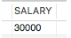
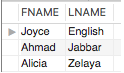
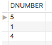
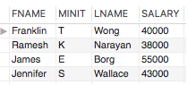
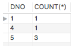
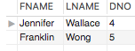

DBMS Assignment

Q1 : Write an SQL query to determine the 5th highest salary from employee table without using TOP or limit method.
- SELECT DISTINCT (A1.SALARY) FROM EMPLOYEE A1 WHERE 5 = (SELECT COUNT(DISTINCT(A2.SALARY)) FROM EMPLOYEE A2 WHERE A1.SALARY <= A2.SALARY);

Q2 : Retrieve the first and last names of employees with the same salary.
- SELECT FNAME , LNAME FROM EMPLOYEE WHERE SALARY IN ( SELECT SALARY FROM EMPLOYEE GROUP BY SALARY HAVING COUNT(*) > 1);

Q3 : Retrieve department number of departments that have less than five employees in it.
- SELECT DNUMBER FROM DEPARTMENT WHERE DNUMBER IN ( SELECT DNO FROM EMPLOYEE GROUP BY DNO HAVING COUNT(*) < 5) OR DNUMBER NOT IN ( SELECT DNO FROM EMPLOYEE) ;

Q4 : Retrieve the names of employees who make at least $10,000 more than the employee who is paid the least in the company.
- SELECT FNAME , MINIT , LNAME , SALARY FROM EMPLOYEE WHERE (SALARY - 10000) >= ( SELECT MIN(SALARY) FROM EMPLOYEE);

Q5 : Retrieve the number of male employees in each department.
- SELECT DNO , COUNT(star)  FROM EMPLOYEE WHERE SEX ='M' GROUP BY DNO;

Q6 : Retrieve the first and last names and department number and name of all employees directly supervised by James Borg. Show results in ascending alpha order (by last name and then first name).
- SELECT E.FNAME , E.LNAME , E.DNO FROM EMPLOYEE E WHERE E.Super_ssn =  ( SELECT S.Ssn FROM EMPLOYEE S WHERE S.FNAME = "James" and S.LNAME = "Borg") ORDER BY E.LNAME , E.FNAME ;
- SELECT E.FNAME , E.LNAME , E.DNO FROM EMPLOYEE E JOIN EMPLOYEE S ON E.SUPER_SSN = S.SSN WHERE S.FNAME = "James" and S.LNAME = "Borg" ORDER BY E.LNAME , E.FNAME ;

